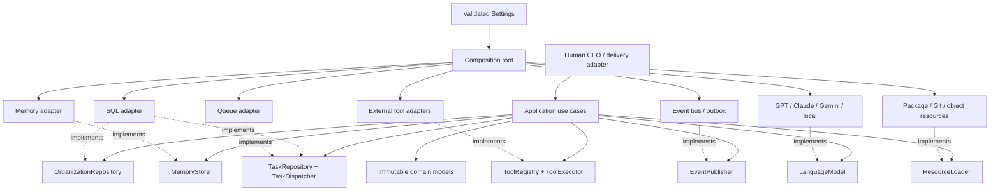

# Dependency graph

Solid arrows are runtime use; dotted arrows are interface implementation. Adapter classes may depend
on domain types and port interfaces. Domain and application modules must never import adapters.

